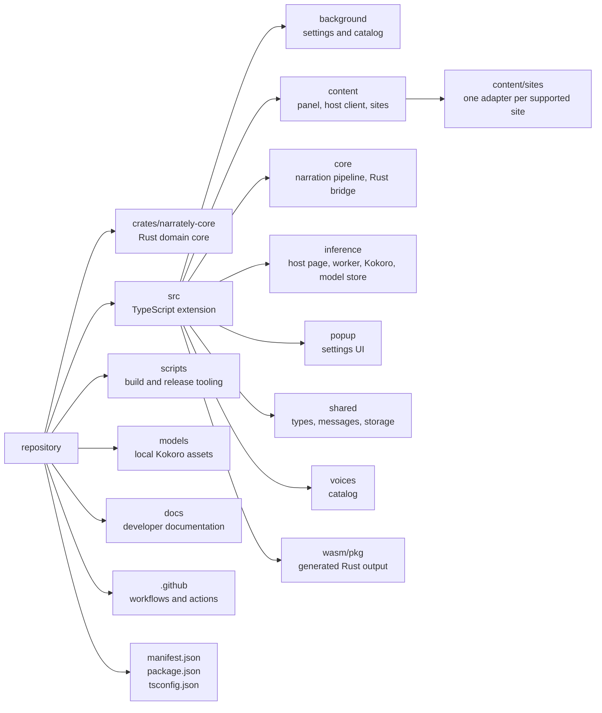

# Narrately developer documentation

This folder is for people who build, change or release Narrately. If you just
want to use it, read the [main README](../README.md).

## Start here

| Document | What it covers |
| --- | --- |
| [Getting started](getting-started.md) | Prerequisites, first build, loading the extension in a browser |
| [Architecture](architecture.md) | Runtime contexts, message flow, data model, storage |
| [Building and packaging](building.md) | npm scripts, the three-pass bundler, `dist/` layout, per-browser manifests |
| [Testing](testing.md) | Automated checks, the offline smoke test, the manual browser checklist |
| [Releasing](releasing.md) | Version scheme, the release workflows, cutting a release |
| [Model and voices](model-and-voices.md) | How the Kokoro model and voice packs are stored and loaded |
| [Adding a supported site](adding-a-site.md) | The site adapter system and a step-by-step guide for new sites |
| [Rust core](rust-core.md) | The WebAssembly domain crate and its API |
| [Design notes](design-notes.md) | Why the code is shaped the way it is (read before "simplifying" things) |
| [Troubleshooting](troubleshooting.md) | Build and runtime problems with known fixes |
| [TypeScript style](TYPESCRIPT_STYLE.md) | Style rules for handwritten TypeScript |

Contribution rules live in [CONTRIBUTING.md](../CONTRIBUTING.md) at the repository root.

## Site support

**[Lnori](https://lnori.com), [Cyrisia](https://cyrisia.com/) and [Novel Archive](https://novelarchive.cc/) are officially supported.**
Each has a dedicated adapter under `src/content/sites/`. The Lnori adapter
supports volume chapter lists; Cyrisia and Novel Archive detect the current
chapter from their reader pages. A generic fallback tries to
find the main text on any other `http(s)` page, so other sites **may** work, but
they are best-effort and untested.

The code is organized around per-site adapters so more sites can be added
without touching the panel or the narration pipeline. See
[Adding a supported site](adding-a-site.md) and
[Architecture](architecture.md#chapter-detection).

## Project goals

- No TTS API keys and no cloud TTS requests at runtime.
- No server-side chapter text processing.
- Curated narration voices bundled as local voice profiles.
- Chrome and Firefox from one codebase.
- Small, testable modules instead of one large content script.
- **Rust** owns deterministic text planning, validation, cache keys and voice-pack metadata.
- **TypeScript** owns browser APIs, DOM work, model workers and playback.

Out of scope: cloud TTS providers, API credentials, server-side text extraction,
voice cloning from a microphone, telemetry.

## Repository layout



```text
.
├── crates/narrately-core/src/   lib.rs, chunker.rs, cache_key.rs, types.rs,
│                                voices.rs, voice_packs.rs
├── models/                      README.md + onnx-community/Kokoro-82M-ONNX/ (generated)
├── scripts/                     build-ts.mjs, manifest.mjs, package-extension.mjs,
│                                zip-release.mjs, sync-model.mjs, smoke-model.mjs
├── src/
│   ├── background/index.ts
│   ├── content/                 index.ts, hostClient.ts, panel.ts, panel.css
│   │   └── sites/               index.ts (registry), types.ts, text.ts, lnori.ts, generic.ts
│   ├── core/                    narration.ts, rustCore.ts
│   ├── inference/               host.html, host.ts, worker.ts, kokoro.ts, modelStore.ts, audio.ts
│   ├── popup/                   index.html, index.ts, popup.css
│   ├── shared/                  browser.ts, extensionUrl.ts, messages.ts, storage.ts, types.ts
│   ├── voices/catalog.ts
│   ├── icons/
│   └── wasm/pkg/                generated Rust/WASM output
├── docs/assets/sites/           site logos used by the README
├── .github/
│   ├── actions/setup-toolchain/ shared Node + Rust setup
│   └── workflows/               release.yml and the release-*.yml stages
├── manifest.json                browser-neutral manifest
└── package.json
```
