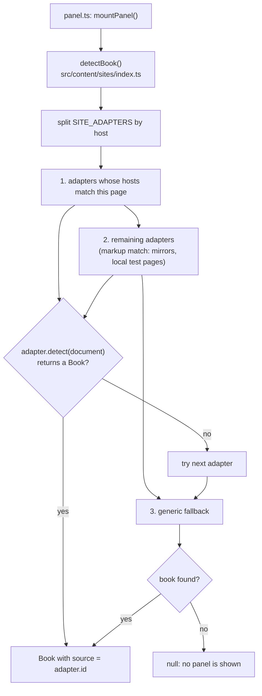
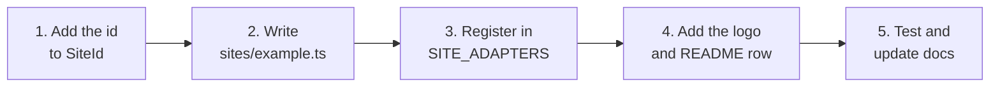

# Adding a supported site

Narrately finds books and chapters through **site adapters**. Each adapter knows
the markup of one website. [Lnori](https://lnori.com) is the only official
adapter today; every other page goes through a best-effort generic fallback.

## How detection works



Everything downstream (panel, chapter picker, narration pipeline) consumes the
plain `Book` and `Chapter` types and does not care which adapter produced them.

## Folder layout

```text
src/content/sites/
├── index.ts     registry (SITE_ADAPTERS) and detectBook()
├── types.ts     the SiteAdapter interface
├── text.ts      shared helpers: normalize, cleanTitle, readParagraphs
├── lnori.ts     official adapter
└── generic.ts   best-effort fallback (never listed in SITE_ADAPTERS)
docs/assets/sites/
├── lnori.svg        site logo for the README (dark artwork)
└── lnori-white.svg  same logo for dark color schemes
```

## The contract

```ts
export interface SiteAdapter {
  readonly id: SiteId;               // Book.source and the logo file name
  readonly name: string;             // display name
  readonly hosts: readonly string[]; // e.g. ['example.com'] (subdomains match too)
  detect(doc: Document): Book | null;
}
```

Rules for `detect`:

- **Pure read.** Do not mutate the page, and do not use the network.
- **Be strict.** Return `null` unless the page clearly is yours. Adapters other
  than the current host's still run, so a loose adapter could claim a foreign page.
- **One chapter needs text.** Skip chapters with no narratable paragraphs, and
  return `null` if none are left.
- Use `readParagraphs()` so every site gets the same cleanup (whitespace,
  navigation and boilerplate lines).
- Give each chapter a stable `id` (prefer the element's own `id`), a title, the
  joined text, and the source `element`.

## Steps



1. **Add the id.** In `src/shared/types.ts`, extend the union:

   ```ts
   export type SiteId = 'lnori' | 'example' | 'generic';
   ```

2. **Write the adapter** in `src/content/sites/example.ts`:

   ```ts
   import type {Book, Chapter} from '../../shared/types';
   import type {SiteAdapter} from './types';
   import {cleanTitle, normalize, readParagraphs} from './text';

   export const exampleAdapter: SiteAdapter = {
     id: 'example',
     name: 'Example',
     hosts: ['example.com'],

     detect(doc: Document): Book | null {
       const root = doc.querySelector('#reader .chapter-body');
       if (!root) {
         return null;
       }
       const paragraphs = readParagraphs(root);
       if (paragraphs.length === 0) {
         return null;
       }
       const chapter: Chapter = {
         id: root.id || 'current',
         title: normalize(doc.querySelector('h1')?.textContent) || 'Chapter',
         text: paragraphs.join('\n\n'),
         element: root,
       };
       return {title: cleanTitle(doc.title), chapters: [chapter], source: 'example'};
     },
   };
   ```

3. **Register it** in `src/content/sites/index.ts`:

   ```ts
   export const SITE_ADAPTERS: readonly SiteAdapter[] = [lnoriAdapter, exampleAdapter];
   ```

4. **Add the logo and a README row.**
   - Save the logo as `docs/assets/sites/example.svg`. If it is dark, also add
     `example-white.svg` for dark color schemes. Keep the original artwork
     unmodified and only recolor for the dark variant.
   - Add a row to the "Supported websites" table in the main
     [README](../README.md), copying the Lnori row.

5. **Test and document.** See the checklist below, and update
   [Architecture](architecture.md#chapter-detection) if the site needs anything
   the current contract does not cover.

## No manifest change needed

The content script already matches every `http(s)` page (`manifest.json`), and
the adapter decides at runtime whether the page is one it knows. Only change the
manifest if you decide to restrict Narrately to specific sites, which would be a
product decision rather than part of adding an adapter.

## Checklist for a new official site

- [ ] `SiteId` member added and adapter registered.
- [ ] `npm run typecheck` passes.
- [ ] Manual test on the real site: panel appears, chapters listed with correct
      titles, narration text contains only story text (no menus, comments, ads).
- [ ] Multi-chapter pages and single-chapter pages both behave.
- [ ] Pages of the site that are *not* chapters do not get a panel.
- [ ] A late-rendering page still gets a panel (the content script retries for 60 s).
- [ ] Logo and README row added, [testing checklist](testing.md) mentions the site.
- [ ] The generic fallback still behaves the same on non-site pages.

## Promoting a site from "may work" to "official"

Official means there is a dedicated adapter, it is maintained against the real
site, and it is in the README table. A site that merely happens to work through
the generic fallback is not official, and bug reports for it are low priority.
