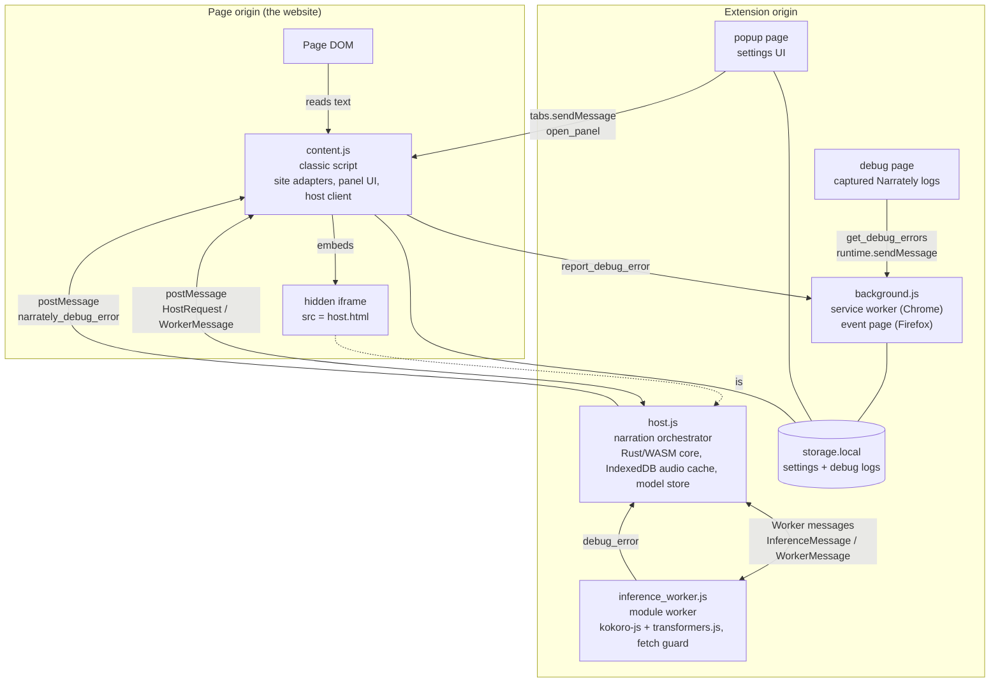
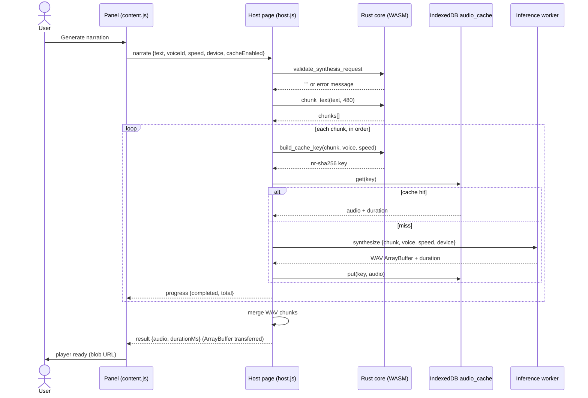
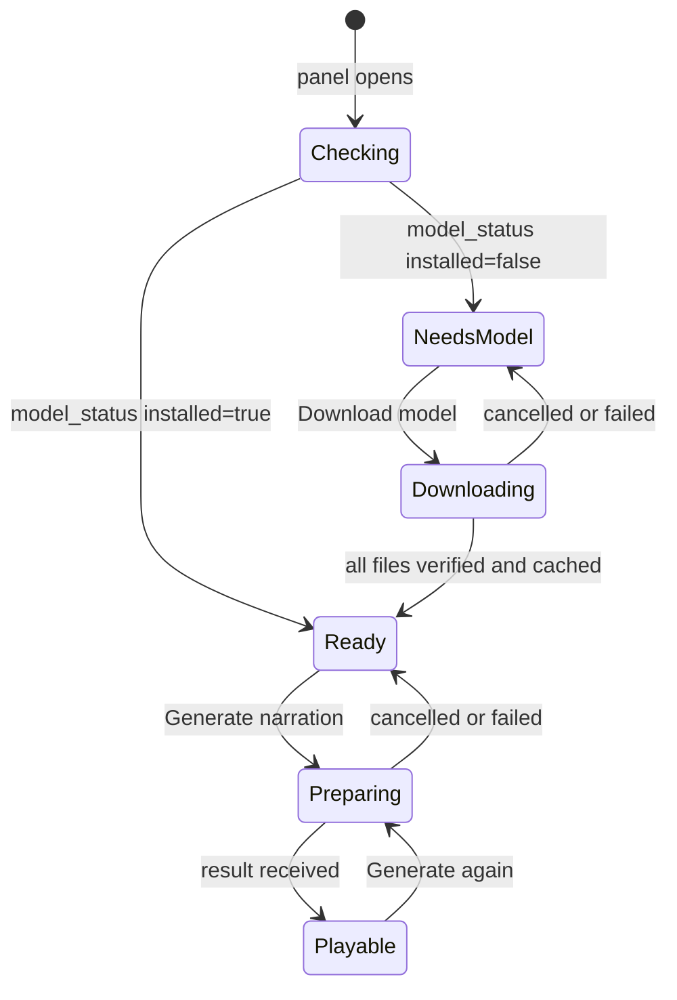
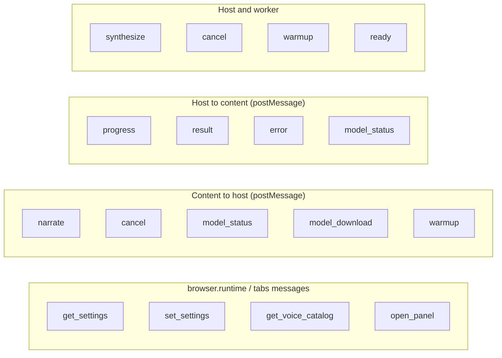
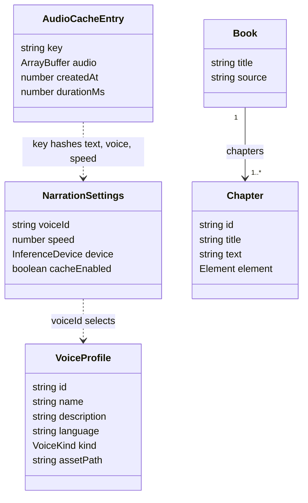
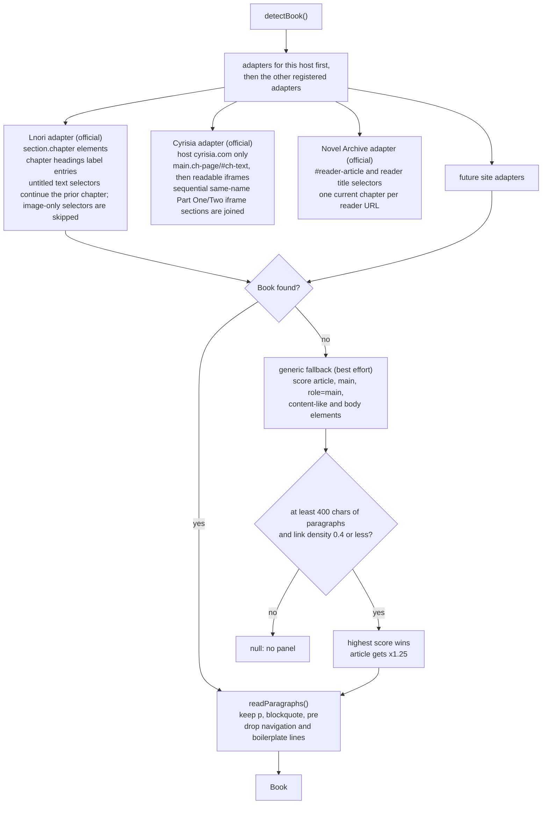

# Architecture

Narrately extracts chapter text in the page, generates speech on the device with
Kokoro-82M, and plays it back inside the page. The browser layer is TypeScript;
the deterministic domain core is Rust compiled to WebAssembly.

## Runtime contexts

Six extension contexts cooperate. Each exists because of a browser restriction
(see [Design notes](design-notes.md)).

| Context | Entry | Bundle format | Responsibilities |
| --- | --- | --- | --- |
| Content script | `src/content/index.ts` | IIFE (classic) | Detect chapters, render the Shadow DOM panel, drive playback, embed the host iframe |
| Host page | `src/inference/host.ts` | ES module | Own the worker, the Rust/WASM core, the audio cache and the model store |
| Inference worker | `src/inference/worker.ts` | ES module worker | Load Kokoro, synthesize one chunk at a time, enforce the local-only fetch guard |
| Background | `src/background/index.ts` | IIFE (classic) | Seed default settings on install; handle settings, panel, and debug-log messages; retain up to 100 local diagnostic records |
| Popup | `src/popup/index.ts` | ES module | Edit settings (reads and writes `storage.local` directly), ask the active tab to open its panel |
| Debug page | `src/popup/debug.ts` | ES module | Display captured Narrately warnings/errors and copy the report; cannot read unrelated browser or page console output |

The manifest declares both Chrome's and Firefox's background style in neutral
form; [`scripts/manifest.mjs`](../scripts/manifest.mjs) emits only the key each
browser accepts. See [Building and packaging](building.md).

## Narrating a chapter

Details worth knowing:

- Cancellation is checked **between chunks**; a chunk that is already
  synthesizing finishes first.
- The worker serializes jobs through a promise chain, so only one chunk runs at a time.
- The cache is skipped entirely when `cacheEnabled` is false.
- Download-to-file is a local `<a download>` click in the panel (file name
  `<book> - <chapter>.wav`). No `downloads` permission is used.

## Panel readiness

When the panel opens and the model is already installed, it is also pre-loaded
(`warmup`) so the first narration starts sooner. `device` (`wasm` or `webgpu`) selects which model files
are required; see [Model and voices](model-and-voices.md).

## Message contracts

All message types are declared in [`src/shared/messages.ts`](../src/shared/messages.ts).
Receivers validate `type` at runtime before narrowing.

| Channel | Direction | Types |
| --- | --- | --- |
| `runtime.sendMessage` | popup/content/debug page to background | settings and panel messages; `report_debug_error`, `get_debug_errors` |
| `tabs.sendMessage` | popup to content | `open_panel` |
| `postMessage` | content to host iframe | `narrate`, `cancel`, `model_status`, `model_download`, `warmup` |
| `postMessage` | host iframe to content | `progress`, `result`, `error`, `model_status`, `narrately_debug_error` |
| `Worker.postMessage` | host to worker | `synthesize`, `cancel`, `warmup` |
| `Worker.postMessage` | worker to host | `progress`, `result`, `error`, `ready`, `debug_error` |

Every request carries a `jobId`. The content-side `HostClient` keeps a
`Map<jobId, listener>`; progress messages keep the listener, while `result`,
`model_status` and `error` settle and remove it. Errors from the worker must
carry the `jobId`, otherwise the request would stay pending forever.

## Data model

- `InferenceDevice` is `'wasm' | 'webgpu'`; `VoiceKind` is `'preset' | 'local_embedding'`.
- `Book.source` is a `SiteId`: the id of the adapter that produced the book (`'lnori'`, `'cyrisia'`, `'novelarchive'`, or `'generic'` for the best-effort fallback). Add a member per new site.
- Defaults: voice `af_heart`, speed `1`, device `wasm`, cache on.

## Chapter detection

Detection is a small plugin system. Each supported website has a **site adapter**
in `src/content/sites/`; `detectBook()` in `sites/index.ts` picks the first adapter
that recognizes the page and falls back to a generic one. The full guide for
adding a site is in [Adding a supported site](adding-a-site.md).

| Adapter | `Book.source` | Support level |
| --- | --- | --- |
| `lnori.ts` (`section.chapter` markup, host `lnori.com`) | `'lnori'` | **Official.** Multi-chapter books, real chapter titles, chapter navigation; untitled text selectors continue the prior chapter and image-only selectors are skipped |
| `cyrisia.ts` (`main.ch-page` and `#ch-text`, host `cyrisia.com`) | `'cyrisia'` | **Official.** Reads the chapter title and story from the live reader, with iframe fallback; sequential selectors for named chapter parts are joined |
| `novelarchive.ts` (`#reader-article`, host `novelarchive.cc`) | `'novelarchive'` | **Official.** One chapter per reader URL, with novel and chapter titles |
| `generic.ts` (scored article or main element) | `'generic'` | **Best effort.** One synthetic chapter named after the first heading; no chapter list; may pick the wrong block on unfamiliar layouts |

Only registered adapters are maintained against a real site. Behaviour on other
sites is not guaranteed and bug reports for them are low priority.

Adapters whose `hosts` match the current page are tried first. The remaining
adapters still run afterwards because they match on page markup, so a mirror or
a local test page imitating a supported site keeps working.

If nothing is found at load, `content/index.ts` watches DOM mutations (debounced
800 ms, up to 60 s) so reader sites that render late still get a panel.

## Storage

| What | Where | Owner |
| --- | --- | --- |
| Settings | `browser.storage.local` key `settings` | background, popup, panel |
| Captured Narrately logs | `browser.storage.local` key `debugErrors` (latest 100) | background, debug page |
| Generated audio | IndexedDB `narrately` / `audio_cache` (extension origin, shared across sites) | host page |
| Model files | Cache API `narrately-model-v1` (extension origin) | host page, worker |
| Voice packs | Bundled in the package under `models/.../voices/` | build |

Permissions requested: `storage`, `unlimitedStorage`, `clipboardWrite` (copy
captured debug logs), and host permissions for Hugging Face (used only for the
model download).

Debug stores up to 100 captured Narrately warnings and errors locally. The
browser does not expose unrelated DevTools console output to extensions.
