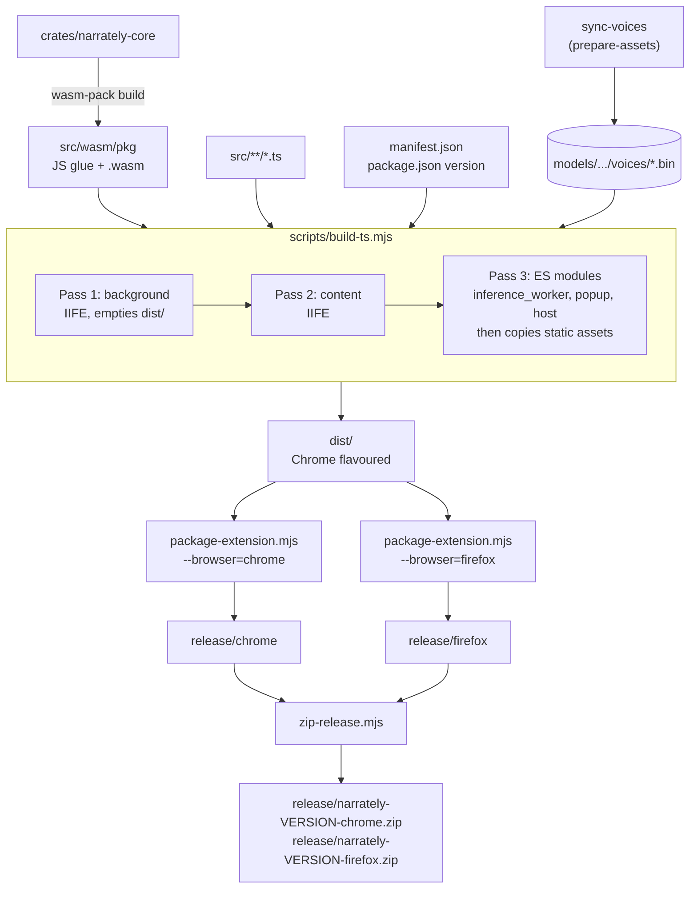
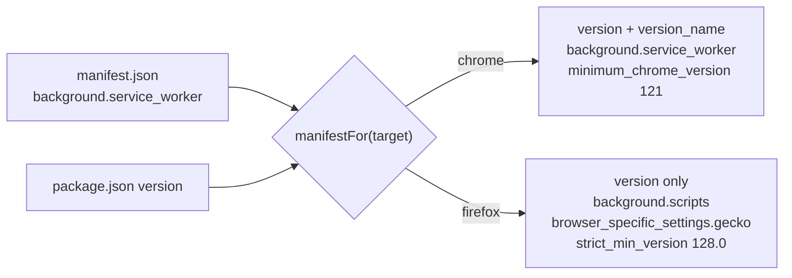

# Building and packaging

## npm scripts

| Script | What it does |
| --- | --- |
| `npm run build:wasm` | `wasm-pack` builds `crates/narrately-core` into `src/wasm/pkg/` |
| `npm run build:ts` | Runs [`scripts/build-ts.mjs`](../scripts/build-ts.mjs) and writes `dist/` |
| `npm run build` | `build:wasm` then `build:ts` |
| `npm run sync-voices` | Copies the 11 curated voice packs from `kokoro-js` into `models/` |
| `npm run sync-model` | Same, plus downloads the pinned model (checksum-verified) for offline builds |
| `npm run package:chrome` | `prepare-assets` + `build` + copy `dist/` to `release/chrome` |
| `npm run package:firefox` | Same, to `release/firefox` with the Firefox manifest |
| `npm run zip` | Zips `release/<browser>` into `release/narrately-<version>-<browser>.zip` |
| `npm run typecheck` | `tsc --noEmit` (strict) |
| `npm run lint:rust` | `cargo fmt --check` and `clippy -D warnings` |
| `npm run test:rust` | `cargo test --workspace` |
| `npm run smoke:model` | Offline synthesis test in Node (see [Testing](testing.md)) |

`wasm-pack` resolves `--out-dir` relative to the crate, which is why the script
targets `../../src/wasm/pkg`.

## Build pipeline



### Why three passes

Manifest-declared content and background scripts are **classic scripts**, so
their bundles cannot contain `import`, `export` or `import.meta`. Each is built
alone as a self-contained IIFE with dynamic imports inlined. The popup, the host
page and the inference worker run in module-capable extension contexts and share
one code-splitting ES-module build.

The last pass also copies the manifest, icons, the `models/` folder and the
compiled WASM package into `dist/`.

## `dist/` layout

```text
dist/
├── manifest.json
├── assets/                  hashed assets incl. the ONNX Runtime .wasm
├── models/                  voice packs (+ model files if you ran sync-model)
└── src/
    ├── background.js        classic: Chrome service worker / Firefox event page
    ├── content.js           classic: content script
    ├── content.css
    ├── inference_worker.js  ES module worker (Kokoro inference)
    ├── host.js, inference/host.html   extension-origin bridge iframe
    ├── popup.js, popup/     popup page
    ├── chunks/              shared module chunks (worker, popup, host only)
    ├── wasm/pkg/            compiled Rust core (glue JS + .wasm)
    └── icons/
```

The ONNX Runtime WebAssembly binary ships as a Vite asset inside `dist/assets/`.
transformers.js resolves it relative to its own module URL, which stays on the
extension origin, so no CDN fetch ever happens and the local-only fetch guard
stays intact.

## Per-browser manifests

`manifest.json` is browser-neutral. `manifestFor(base, target, version)` in
[`scripts/manifest.mjs`](../scripts/manifest.mjs) adapts it.



- Chrome rejects `background.scripts` in MV3; Firefox does not run `background.service_worker`.
- Browsers accept only numeric `version`. `0.1.0-beta.2` becomes version `0.1.0.2`
  and `version_name` `0.1.0-beta.2` (Chrome shows it; Firefox drops the key).
  See [Releasing](releasing.md#version-mapping).
- The Firefox `gecko.id` in `manifest.mjs` is a placeholder
  (`narrately@example.invalid`). That is fine while Narrately is distributed only
  through GitHub Releases; it would need a real ID before any store submission.

## Distribution

Narrately is in beta and is distributed **only through GitHub Releases**. It is
not published to the Chrome Web Store or Firefox Add-ons.

- **Chrome:** users unzip `narrately-<version>-chrome.zip` and use *Load unpacked*.
- **Firefox:** users unzip `narrately-<version>-firefox.zip` and load `manifest.json`
  as a temporary add-on. The build is unsigned, so Firefox removes it on restart.

Source maps are excluded from the zips. Re-run the [automated checks](testing.md#automated-checks)
and the manual checklist on a clean browser profile before cutting a release.
