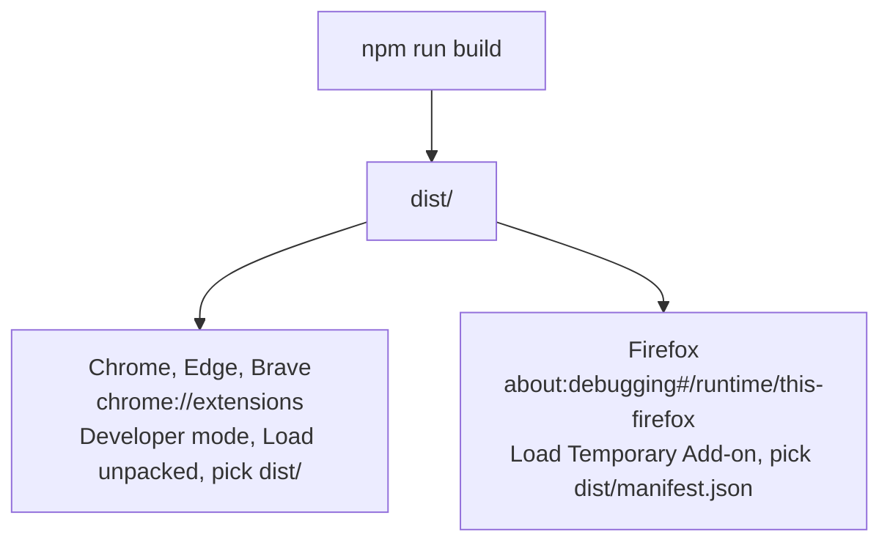

# Getting started

## Prerequisites

- **Node.js 20+** and npm 10+ (CI uses Node 22).
- **Rust stable** with the `wasm32-unknown-unknown` target and the `rustfmt` and `clippy` components:

  ```bash
  curl --proto '=https' --tlsv1.2 -sSf https://sh.rustup.rs | sh -s -- -y
  rustup target add wasm32-unknown-unknown
  rustup component add rustfmt clippy
  ```

  `wasm-pack` comes from `devDependencies`, so no global install is needed.
- Internet access for `npm install` and, if you want a fully offline build, the
  one-time model download (see [Model and voices](model-and-voices.md)).
- Chrome 121+ and/or Firefox 128+ for manual testing.

## First build

```bash
npm install
npm run sync-voices   # copy the 11 curated voice packs into models/
npm run build         # build:wasm (Rust -> WASM) then build:ts (bundle -> dist/)
```

The speech model is **not** needed to build. Users download it from the panel.
Run `npm run sync-model` instead of `sync-voices` if you want the model bundled
for fully offline use.

If you only change TypeScript and `src/wasm/pkg/narrately_core.js` already
exists, `npm run build:ts` alone is enough.

## Load the extension



`dist/` is a **Chrome-flavoured** build. To test the Firefox manifest (which uses
`background.scripts` instead of a service worker), build the Firefox package and
load `release/firefox/manifest.json`:

```bash
npm run package:firefox
```

Temporary Firefox add-ons are removed on restart; reload them after restarting.

## Everyday loop

1. Edit code.
2. `npm run build:ts` (add `build:wasm` if you touched Rust).
3. Click **Reload** on the extension card (`chrome://extensions`) or in `about:debugging`.
4. Reload the test page, because content scripts only attach on page load.

Before opening a PR, run the checks in [Testing](testing.md).
