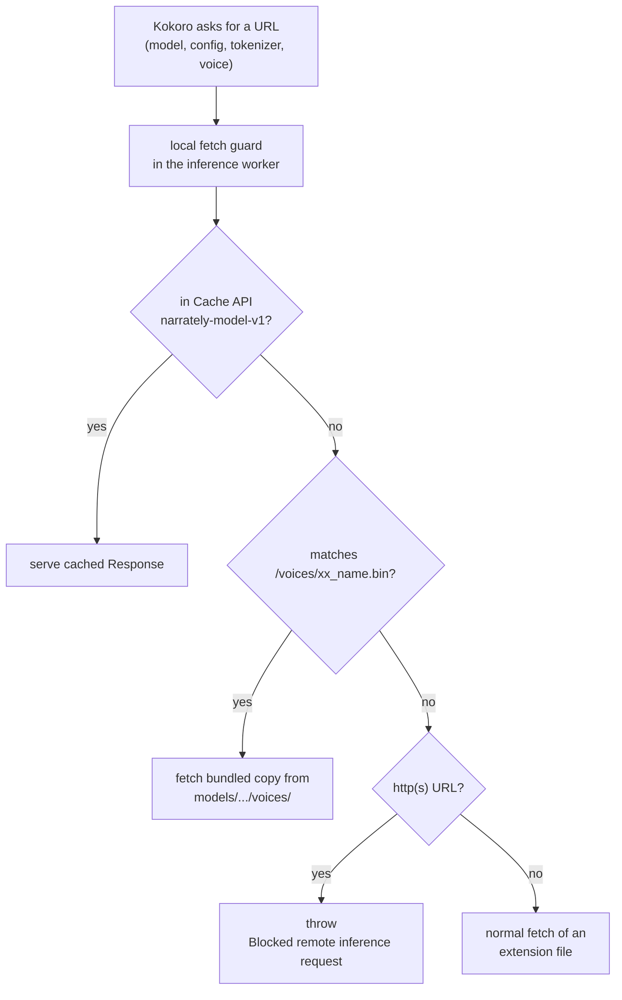
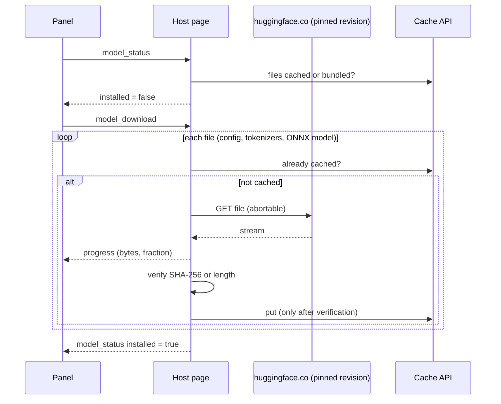

# Model and voices

## What ships and what does not

| Asset | Size | Shipped in the package? | How it gets to the user |
| --- | --- | --- | --- |
| 11 curated voice packs (`voices/*.bin`) | small | **Yes** | Copied from `kokoro-js` at build time (`sync-voices`) |
| Quantized ONNX model (WASM device) | about 88 MB | No | In-panel **Download model** |
| Full-precision ONNX model (WebGPU device) | about 312 MB | No | In-panel **Download model**, when the device is WebGPU |
| ONNX Runtime WASM + loader | bundled | **Yes** | Vite assets in `dist/assets/` |

Sizes are shown the way the panel's progress readout reports them (binary units, 1 MB = 1,048,576 bytes, labelled "MB"). In decimal units the two models are about 92 MB and 327 MB.

For a fully offline build, run `npm run sync-model` before packaging. Files under
`models/onnx-community/Kokoro-82M-ONNX/` are then used directly and the panel
sees the model as already installed. Keep large binaries out of git; they are
git-ignored.

## How the model is resolved

- The guard replaces `globalThis.fetch` **and** `env.fetch` (transformers.js binds
  its own fetch at import time).
- `env.allowRemoteModels = false`, `env.localModelPath` points at the extension's `models/`.
- WASM uses `dtype: 'q8'`; WebGPU uses `dtype: 'fp32'`. Switching devices reloads the engine.
- The ONNX Runtime loader and WASM are imported with `?url` so they are bundled
  and loaded from the extension; transformers.js would otherwise use a CDN URL
  that the guard blocks.

## Downloading the model

The download runs in the **host page** (extension origin, not the worker), so the
guard does not apply to it. That is the only place a remote request is allowed.

- Pinned revision: `f46687f7e41512228ae953af24a11b2640ea0f22` (see
  `src/inference/modelStore.ts` and `scripts/sync-model.mjs`; keep them in sync).
- The WASM model has a SHA-256 in the code; the small JSON files are checked by
  length. The full-precision WebGPU model has no pinned checksum yet.
- Files are stored under a synthetic key `https://narrately.invalid/model/<name>`
  because the Cache API rejects `chrome-extension://` keys.
- `VITE_MODEL_BASE` overrides the remote base URL at build time (useful for mirrors and tests).
- Progress weights: small files 1–2% each, the ONNX file 96%.

## Voices

The catalog exists twice, deliberately: Rust (`voices.rs`) validates requests,
TypeScript (`src/voices/catalog.ts`) feeds the UI. Both must list the same 11 voices.

| ID | Name | Language |
| --- | --- | --- |
| `af_heart` | Heart | en-US |
| `af_bella` | Bella | en-US |
| `af_nicole` | Nicole | en-US |
| `af_sarah` | Sarah | en-US |
| `af_sky` | Sky | en-US |
| `am_adam` | Adam | en-US |
| `am_michael` | Michael | en-US |
| `bf_emma` | Emma | en-GB |
| `bf_isabella` | Isabella | en-GB |
| `bm_george` | George | en-GB |
| `bm_lewis` | Lewis | en-GB |

To add a voice:

1. Add its ID to `voice_ids` in `scripts/sync-model.mjs`.
2. Add it to `voices.rs` (and update the count in its unit test) and to `src/voices/catalog.ts`.
3. Run `npm run sync-voices && npm run build`.

### Why presets only

Kokoro-82M provides speaker/style embeddings rather than arbitrary
reference-audio voice cloning, so Narrately ships curated voices. The Rust
voice-pack format already supports a future `local_embedding` kind: the crate
validates a 256-value finite embedding (`validate_voice_embedding`). A compatible
speaker-encoder backend could be added later without changing the browser UI or
the chapter pipeline.

## Execution backends

Kokoro runs on WASM (compatibility baseline) or WebGPU. WASM is the default;
WebGPU is opt-in in settings and needs its own model. Inside a web page the
extension frame cannot be cross-origin isolated, so the WASM engine runs on a
single CPU thread.
