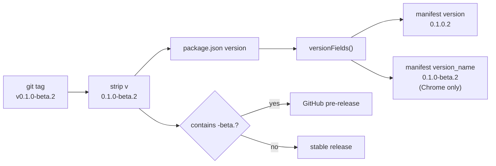
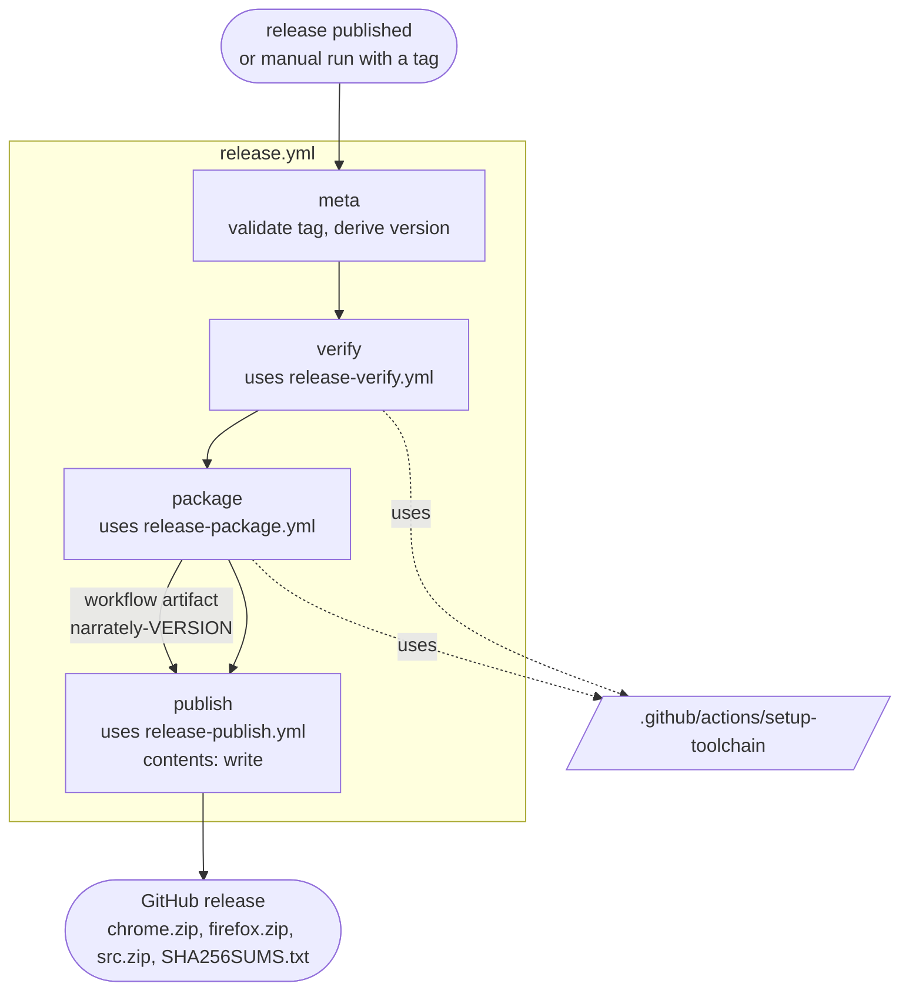

# Releasing

Versions come from the git tag; `package.json` is the single source of truth for
local builds.

## Version mapping

| Tag | Manifest `version` | Manifest `version_name` | Release type |
| --- | --- | --- | --- |
| `v0.1.0-beta.1` | `0.1.0.1` | `0.1.0-beta.1` | pre-release (Beta badge in the UI) |
| `v0.1.0-beta.2` | `0.1.0.2` | `0.1.0-beta.2` | pre-release |
| `v1.0.0` | `1.0.0` | (none) | stable |

Browsers accept only numeric `version` values, so the beta number becomes the
fourth component and the readable name goes in `version_name` (Chrome shows it;
Firefox ignores it, so Firefox builds show the numeric version). Accepted tag
format: `vX.Y.Z` or `vX.Y.Z-beta.N`. Anything else fails the first workflow job.



**Ordering rule:** browsers compare versions numerically, and `0.1.0.2` is newer
than `0.1.0`. A stable release therefore needs a higher `X.Y.Z` than every beta
before it (for example betas of `0.1.0`, then stable `1.0.0` or `0.2.0`), or
users on the beta will not be offered the update.

## Cut a release

1. Set `version` in `package.json` to match the tag you will create, and update `CHANGELOG.md`.
2. Tag and publish a GitHub release, for example:

   ```bash
   gh release create v0.1.0-beta.2 --title "0.1.0-beta.2" --notes-file CHANGELOG.md --prerelease
   ```

3. The **Release build** workflow tests, builds and attaches
   `narrately-<version>-chrome.zip`, `-firefox.zip`, `-src.zip` and
   `SHA256SUMS.txt` to the release.

To rebuild an existing release, run the workflow manually from the Actions tab
(**Release build**, *Run workflow*) and enter its tag.

## The release workflows

The pipeline is split into small files so each stage can be read, changed and
reasoned about on its own.

| File | Kind | Purpose |
| --- | --- | --- |
| `.github/workflows/release.yml` | Entry workflow | Triggers, permissions, concurrency, tag validation; calls the stages in order |
| `.github/workflows/release-verify.yml` | Reusable (`workflow_call`) | `cargo test --workspace` and `npm run typecheck` |
| `.github/workflows/release-package.yml` | Reusable | Builds Chrome and Firefox, zips them with the source archive, writes `SHA256SUMS.txt`, uploads a workflow artifact |
| `.github/workflows/release-publish.yml` | Reusable | Downloads the artifact, attaches it to the release, marks betas as pre-release |
| `.github/actions/setup-toolchain/action.yml` | Composite action | Node 22, Rust with the wasm32 target, caches, `npm ci` |



Design points:

- **Least privilege.** The workflow runs with `contents: read`; only the
  `publish` job is granted `contents: write`.
- **One tag, one run.** Concurrency is keyed on the tag and never cancels an
  in-progress run.
- **Stages talk through artifacts.** `package` uploads `narrately-<version>`;
  `publish` downloads it into `release/`. `publish` needs no checkout and
  targets the repository through `GH_REPO`.
- **Tag handling.** The tag is passed around as an input or environment
  variable and never interpolated straight into a shell script.
- **Cost of the split.** `verify` and `package` each install dependencies on
  their own runner. In exchange, a failing test stops the pipeline before the
  heavier build starts.
- **Same-commit stages.** Reusable workflows are referenced as
  `./.github/workflows/…`, so they come from the same commit that triggered the
  run, while the build itself checks out the release tag.

### Adding or changing a stage

1. Put new logic in its own `release-<stage>.yml` with `on: workflow_call`, typed inputs and minimal `permissions`.
2. Add a job to `release.yml` that `uses:` it and declares `needs:`.
3. Share repeated setup in a composite action under `.github/actions/`. Composite steps that run shell code need `shell: bash`.
4. Lint with [actionlint](https://github.com/rhysd/actionlint): `actionlint .github/workflows/*.yml`.

## Local build

```bash
npm ci
npm run package:chrome          # prepares release/chrome
npm run package:firefox         # prepares release/firefox
npm run zip                     # release/narrately-<version>-<browser>.zip
```

The speech model is not bundled; users download it from the panel.
