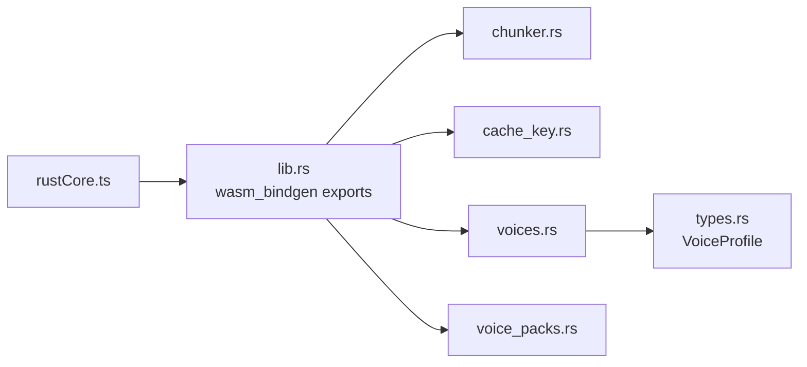
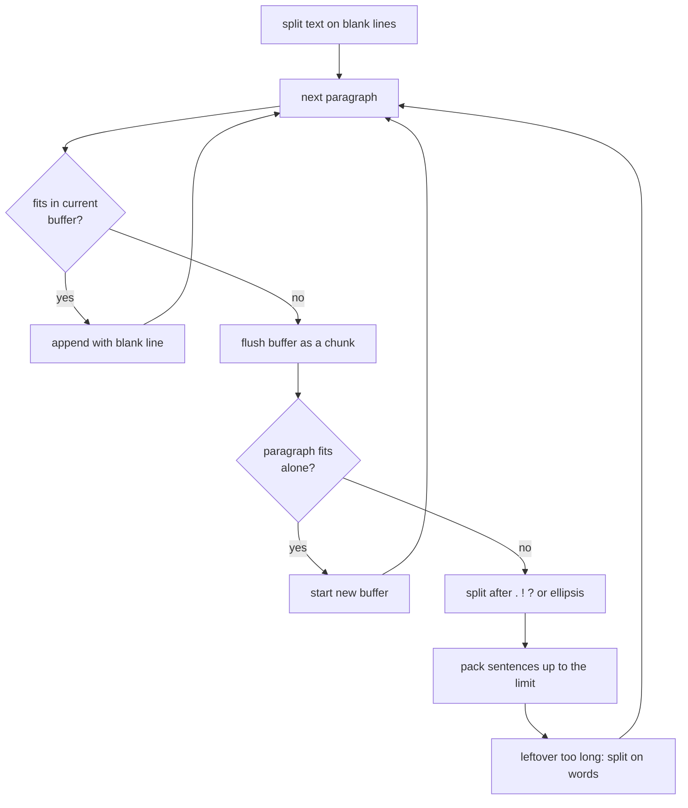

# Rust core

`crates/narrately-core` holds everything deterministic: text planning,
request validation, cache keys and voice metadata. It compiles to WebAssembly
via `wasm-pack` and is consumed only through
[`src/core/rustCore.ts`](../src/core/rustCore.ts).

## Modules



## Exported API

| Rust export | TypeScript wrapper | Returns |
| --- | --- | --- |
| `chunk_text(text, max_chars)` | `splitText(text, maxChars = 480)` | JSON array of strings |
| `validate_synthesis_request(text, voice_id, speed)` | `validateRequest(...)` | `""` when valid, otherwise an error message (the wrapper throws) |
| `build_cache_key(text, voice_id, speed)` | `cacheKey(...)` | `nr-<sha256 hex>` |
| `default_voice_catalog()` | `voiceCatalog()` | JSON array of voice profiles |
| `validate_voice_embedding(values)` | not wired yet | `""` or an error message |

Rust returns JSON strings and plain strings across the boundary; the TypeScript
side parses them and checks the shape at runtime before use.

### Validation rules

- Text must not be empty or whitespace.
- A voice is required and must be in the catalog.
- Speed must be within 0.5 to 2.0 (the panel slider is narrower, 0.6 to 1.6).
- A voice embedding has exactly 256 finite values.

### Cache key

SHA-256 over `text`, `0x00`, `voice_id`, `0x00`, the speed as little-endian
`f32` bytes, prefixed with `nr-`. Changing any input yields a different key.
There is no model or device component, so clear the cache after changing models.

## Chunking

`chunk_text` splits narration into pieces of at most `max_chars` bytes (minimum
64), keeping paragraphs together when they fit and cutting at sentence ends,
then words, only when they do not.



`max_chars` is measured in bytes (`str::len`), which is slightly conservative for
non-ASCII text.

## Working on the crate

```bash
cargo fmt --all
cargo clippy --workspace --all-targets --all-features -- -D warnings
cargo test --workspace
npm run build:wasm      # regenerate src/wasm/pkg
```

Rust follows `rustfmt` and `clippy`. The cross-language domain API uses the same
concepts and names on both sides: TypeScript keeps domain names in `snake_case`
at the core boundary, while UI-only DOM helpers may stay `camelCase`. Comments
are short and explain intent, not syntax.

The generated files in `src/wasm/pkg/` (except `narrately_core.d.ts` and the
README) are git-ignored; regenerate them with `npm run build:wasm`. wasm-pack also
writes a `.gitignore` containing `*` into that folder; the build script deletes it
so the repository keeps a single root `.gitignore`.
