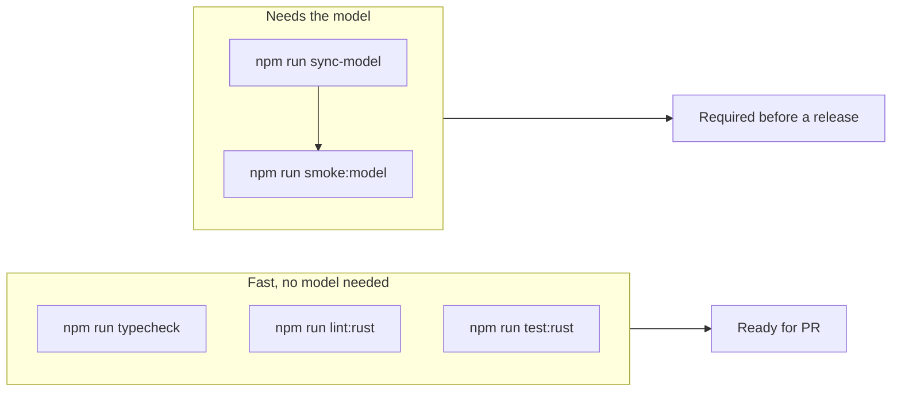

# Testing

## Automated checks

Run these before every PR and every release:

```bash
npm audit              # expect 0 vulnerabilities
npm run typecheck      # strict TypeScript, no emit
npm run lint:rust      # cargo fmt --check + clippy -D warnings
npm run test:rust      # chunker + voice catalog unit tests
npm run smoke:model    # offline synthesis (needs sync-model first)
```



CI (the release workflow) runs `cargo test --workspace` and `npm run typecheck`
on every release build. Lint, audit and the smoke test are run by hand.

### Smoke test

`npm run smoke:model` disables remote model access
(`env.allowRemoteModels = false`), loads the pinned model from `models/`,
synthesizes a sentence with `af_heart` and writes `smoke-test-output.wav`. It
prints the sample count and duration on success. Play the file to hear it, then
delete it (it is git-ignored; with `CI` set the script deletes it itself). The
script ends with `process.exit(0)` because onnxruntime keeps worker threads
alive.

It requires the model: run `npm run sync-model` first.

## Manual browser testing

### Load the extension

See [Getting started](getting-started.md#load-the-extension).

### Prepare a test page

Test against **Lnori** first; it is the only officially supported site. Any
change under `src/content/sites/` must keep the Lnori path working. Other sites are
optional, best-effort checks. When you add a site, add its own row to the checklist below (see [Adding a supported site](adding-a-site.md#checklist-for-a-new-official-site)). Options:

- Any long article with several `<p>` elements (Wikipedia works well) to exercise the generic fallback.
- A local `test.html` opened via `file://`. The manifest matches only
  `http(s)`, so serve it with a local server (for example
  `python3 -m http.server`) instead.
- A minimal page that imitates Lnori's markup for the Lnori adapter:

  ```html
  <section class="chapter">
    <h2 class="chapter-title">Chapter One</h2>
    <p>…</p>
  </section>
  ```

### Checklist

| # | Step | Expected result |
| --- | --- | --- |
| 1 | Open a Lnori chapter page | A round bubble appears; the chapter list shows the book's chapters |
| 2 | Click the bubble | The panel opens: chapter and voice selects, speed slider, text preview toggle, Generate button, status line |
| 3 | First run, no model | A "Voice model needed" card offers **Download model**; Generate is disabled |
| 4 | Click **Download model** | Progress with a cancel option; ends with "Voice model ready."; works again after reloading the page |
| 5 | Toolbar icon, popup | Voice list has 11 entries; change device or speed, **Save settings** shows "Saved locally." |
| 6 | Popup, **Open narrator on this page** | The in-page panel opens |
| 7 | Panel, **Generate narration** | Progress with part count and time estimate; the player appears when the chapter is ready |
| 8 | Generate the same chapter again, cache on | Finishes much faster (IndexedDB hits) |
| 9 | Close the panel mid-generation | Preparation continues; a green dot shows on the bubble when ready |
| 10 | **Download** | Save dialog offers `<book> - <chapter>.wav`; plays in any audio player |
| 11 | DevTools, Network (page and extension contexts) | Only the model download hits `huggingface.co`. No other remote requests |
| 12 | Console | No `SyntaxError` from `content.js`, no `SecurityError` from `new Worker`, no `Blocked remote inference request` |
| 13 | Disable the extension | Panel disappears; the page keeps working |

Tip for step 11: in Chrome the worker's requests appear under the
`chrome-extension://<id>` context in DevTools; in Firefox use **Inspect** on the
extension in `about:debugging`.

### What you should never see

- Requests from the inference **worker** to `huggingface.co`, `cdn.jsdelivr.net`
  or any other `https://` URL. The fetch guard turns them into a thrown
  `Blocked remote inference request: …` error on purpose. The model download is
  made by the host page, not the worker.
- Voice files downloading at runtime. The 11 `*.bin` voice packs ship inside the package.
